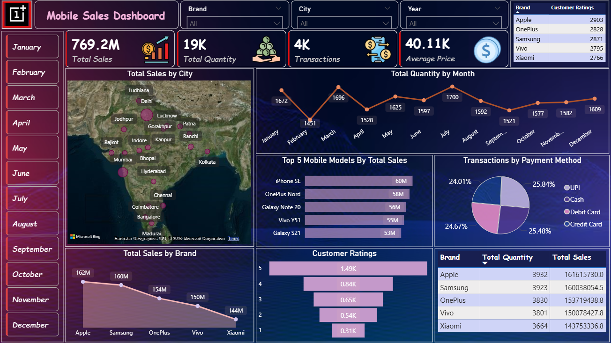

# 📊 Mobile Sales Dashboard | Power BI


**An interactive Power BI dashboard that analyzes mobile sales performance, customer behavior, and key business KPIs across multiple dimensions to deliver clear and actionable business insights.**


---

## 📚 Table of Contents
- [Overview](#overview)
- [Problem Statement](#problem-statement)
- [Dataset](#dataset)
- [Tools & Technologies](#tools-technologies)
- [Dashboard Highlights](#dashboard-highlights)
- [How to Explore the Dashboard Interactively](#how-to-explore)
- [Project Structure](#project-structure)
- [Key Learnings](#key-learnings)
- [Dashboard Preview](#dashboard-preview)
- [Results & Conclusion](#results)
- [Author](#author)

---

## 📌 Overview <a id="overview"></a>

The **Mobile Sales Dashboard** transforms raw mobile sales data into meaningful insights using Power BI’s interactive visualization capabilities.

It provides a consolidated view of sales performance, transaction behavior, customer preferences, and brand-level trends, allowing users to explore insights across **time, geography, and product dimensions**.

The project focuses on **clarity, interactivity, and business relevance**, making complex sales data easy to interpret and analyze.

---

## 🎯 Problem Statement <a id="problem-statement"></a>

Businesses operating in the mobile retail space often struggle to:
- Monitor overall sales and transaction performance
- Understand city-wise and brand-wise demand patterns
- Identify top-performing mobile models
- Analyze customer purchase behavior and payment preferences
- Track monthly sales and quantity trends effectively

This dashboard addresses these challenges by presenting critical KPIs and insights in a single, interactive Power BI dashboard.


---

## 📂 Dataset <a id="dataset"></a>

- **File:** `raw-dataset.xlsx`
- **Location:** `data/`

The dataset contains transactional mobile sales data with the following attributes:
- Transaction ID  
- Date information (Day, Month, Year, Day Name)  
- Brand and Mobile Model  
- Units Sold  
- Price per Unit  
- Customer details (Name, Age)  
- City-wise sales data  
- Payment Method  
- Customer Ratings  

---

## 🛠 Tools & Technologies <a id="tools-technologies"></a>

- Power BI  
- Power Query (Data Cleaning & Transformation)  
- DAX for KPI Calculations  
- Interactive Visualizations & Filters  
- Dashboard Design & Layout Principles  

---

## 📈 Dashboard Highlights <a id="dashboard-highlights"></a>

The dashboard provides insights into:
- **Total Sales, Total Quantity, Transactions, and Average Price KPIs**
- **City-wise Sales Distribution (Map View)**
- **Monthly Quantity Trends**
- **Top 5 Mobile Models by Total Sales**
- **Transactions by Payment Method**
- **Brand-wise Sales and Quantity Performance**
- **Customer Ratings Distribution**
- **Interactive filtering across Brand, City, Year, and Month**

---

## 🔍 How to Explore the Dashboard Interactively <a id="how-to-explore"></a>

To experience the full interactivity of the dashboard:

1. **Download the Power BI dashboard file**  
  👉 [mobile-sales-dashboard.pbix](dashboard/mobile-sales-dashboard.pbix)  
   - Click **View raw** to start the download.
   

2. **Open the file in Power BI Desktop**.

3. Interact with the dashboard using:
   - Slicers (Brand, City, Year, Month)
   - Clicking on charts, bars, lines, or map visuals

4. Any selection dynamically updates:
   - KPI cards  
   - Charts and comparisons  
   - Insights across time, brands, and cities  

---

## 📁 Project Structure <a id="project-structure"></a>
```
mobile-sales-dashboard-powerbi/
├── README.md
├── dashboard/
│   └── mobile-sales-dashboard.pbix
├── data/
│   └── raw-dataset.xlsx
└── images/
    └── dashboard-overview.png
```
---

## 🚀 Key Learnings <a id="key-learnings"></a>

- Gained hands-on experience in building interactive Power BI dashboards  
- Learned effective data cleaning and transformation using Power Query  
- Applied DAX to calculate meaningful KPIs  
- Improved dashboard design for clarity and usability  
- Strengthened ability to analyze sales trends across time, brands, and locations  
- Enhanced data storytelling by converting raw data into actionable insights  

---

## 🖼 Dashboard Preview <a id="dashboard-preview"></a>



---

## ✅ Results & Conclusion <a id="results"></a>

The dashboard successfully delivers a comprehensive and interactive view of mobile sales performance by:
- highlighting key sales and transaction metrics,
- revealing brand-wise and city-level trends,
- enabling easy comparison across different time periods,
- supporting informed, data-driven business decisions.

It demonstrates the effective use of **Power BI for sales analysis and business intelligence reporting**.

---

## 👤 Author <a id="author"></a>

**Jagjeet Singh**  
Aspiring Data Analyst  

[](https://github.com/jagjeet-analytics)
[](https://www.linkedin.com/in/jagjeet-singh3110/)
[](mailto:jagjeetsingh.analytics@gmail.com)
